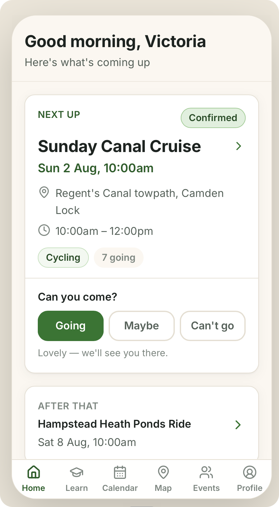
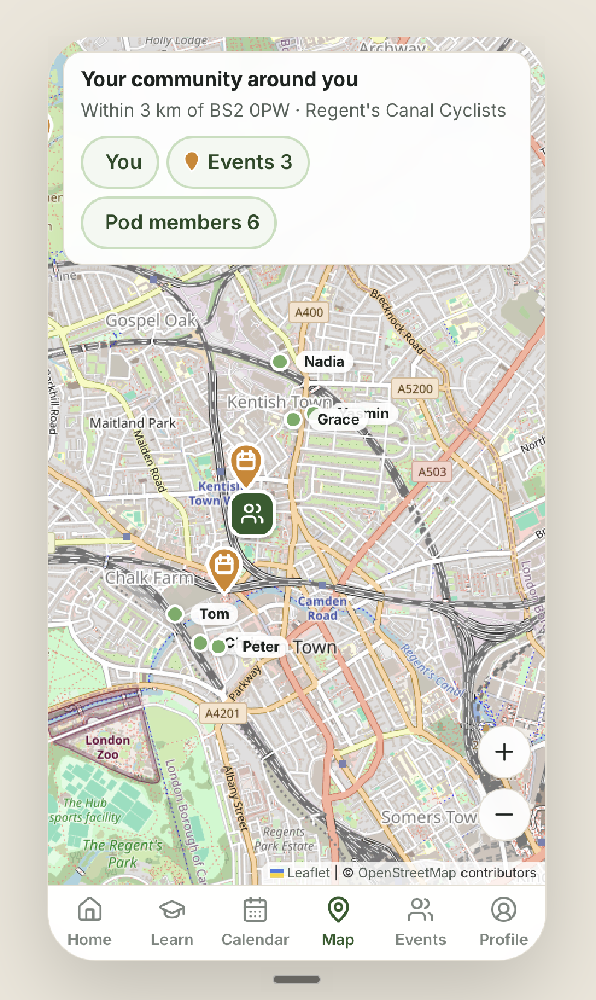
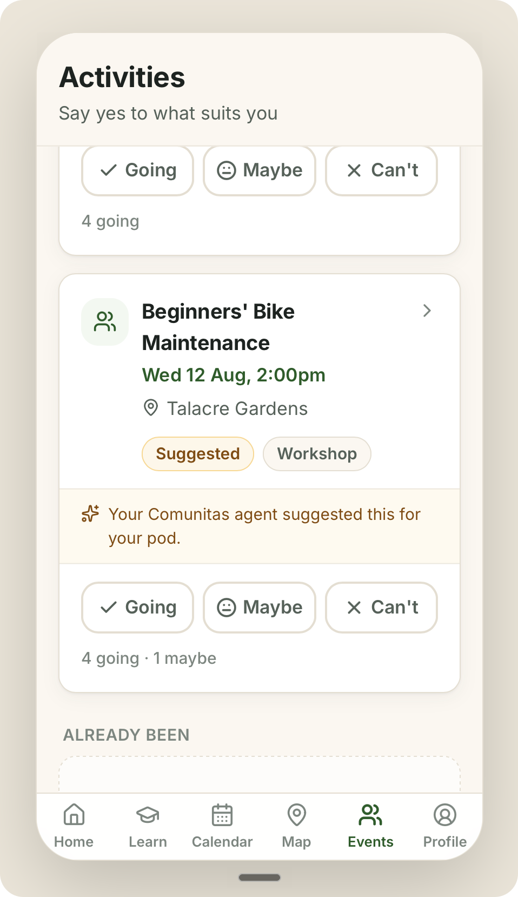
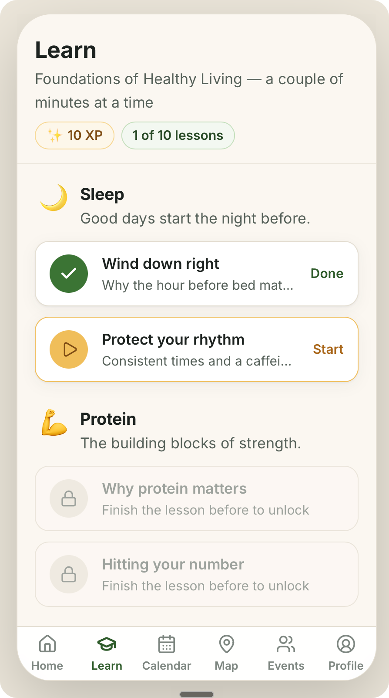

# Comunitas

### Healthy change, made together.

Comunitas turns a GP's lifestyle prescription into a plan with people in it —
matching patients into local **pods** of people with similar health goals, then
planning the group's activities for them.

[API](https://comunitas-api.vercel.app/api/health) ·
[Product brief](docs/project-plan.md) ·
[Development guide](docs/development.md) ·
[Deployment](docs/deployment.md)

 

&nbsp;
&nbsp;
&nbsp;

---

## Why

Most GP prescriptions for prevention aren't drugs — they're **lifestyle
interventions**: move more, sleep better, eat differently. But when a patient
receives that advice, they're typically handed a pamphlet and sent on their
way. Building a programme, staying adherent, and finding support are all left
to the patient alone — even though adherence is what actually determines the
health outcome.

## What Comunitas does

Comunitas gives every lifestyle prescription a community and a calendar:

- **Match people first, plan events second.** In an inversion of the usual
  meetup model, patients are grouped into pods by geography, health
  conditions, goals, and starting fitness — then activities are chosen to fit
  the group, discovered from what's already popular nearby or created ad hoc.
- **No organiser burden.** AI booking agents handle the planning, scheduling,
  and coordination. No single member is responsible for keeping the group
  alive.
- **Support the habit, not just the event.** Bite-sized lessons, attendance
  streaks, and a shared calendar keep the programme going between sessions.

Built at the Juno Health hackathon (London, July 2026).

## The app

A mobile-first responsive web app (phone-framed on desktop) covering the
patient-facing loop:

- **Voice induction** — a real conversation, not a form. An AI interviewer on
  OpenAI's Realtime API (`gpt-realtime-2.1`, WebRTC) discovers the patient's
  location and travel range, health conditions, goals, starting fitness,
  interests, weekly availability, and constraints — filling a live profile card
  as it learns. Ends with the pod reveal. Speaking is push-to-talk: hold the
  talk button (or the space bar) while answering, release to send — no
  automatic voice detection. A keyboard button switches to typed chat
  mid-conversation, and typed chat is also the automatic fallback when no
  microphone is available (or with `/induction?mode=text`).
- **Home** — next event with one-tap RSVP, pod snapshot, attendance streak.
- **Learn** — Duolingo-style bite-sized lessons on the habits behind the plan
  (sleep, protein, fibre, water, movement). Lessons unlock sequentially along
  one track, mix info cards with quick check questions, and award 10 XP each;
  progress is stored on the server so it follows the patient across devices.
- **Profile** — the structured, matcher-ready profile; every section
  tap-to-edit, postcodes geocoded via postcodes.io. An Induction card lets you
  finish a skipped induction or redo a completed one (the conversation resumes
  on the same patient and re-runs pod matching).
- **Skippable induction** — signed-in users can skip the induction from its
  intro screen (a bare patient record is created so the rest of the app works);
  a banner pinned above every screen offers the way back in until it's done.
- **Pod** — who you're matched with (first names and shared interests only —
  no one else's health data), and where the group meets.
- **Calendar** — month view with per-day agenda of pod activities.
- **Map** — Leaflet/OpenStreetMap view of you, your travel radius, upcoming
  event venues, and approximate pod-member locations.
- **Events & history** — upcoming feed with RSVPs, past timeline with
  attendance and adherence streaks.
- **Sign-in** — optional "Continue with Google" / "Continue with GitHub"
  buttons on the welcome screen link your browser session to a patient record
  (via better-auth), so the app remembers you across devices; sign out from
  Profile. The anonymous flows — voice induction and **Continue as Priya
  (demo)** — are unaffected and remain the fastest way in.

Pod assignment currently uses a nearest-pod heuristic (geography first, per the
product thesis); the profile schema is deliberately rich so the real matching
engine can slot in behind the same API.

## Documentation

| Doc                                                | What's in it                                            |
| -------------------------------------------------- | ------------------------------------------------------- |
| [docs/development.md](docs/development.md)         | Monorepo layout, prerequisites, setup, env vars, scripts, gotchas |
| [api/README.md](api/README.md)                     | API overview, seed data, bulk demo-user seeder, tests   |
| [docs/deployment.md](docs/deployment.md)           | The two Vercel projects and their build constraints     |
| [docs/project-plan.md](docs/project-plan.md)       | Product brief                                           |
| [docs/superpowers/specs](docs/superpowers/specs)   | Design docs (induction app, learn track, user seeder)   |
